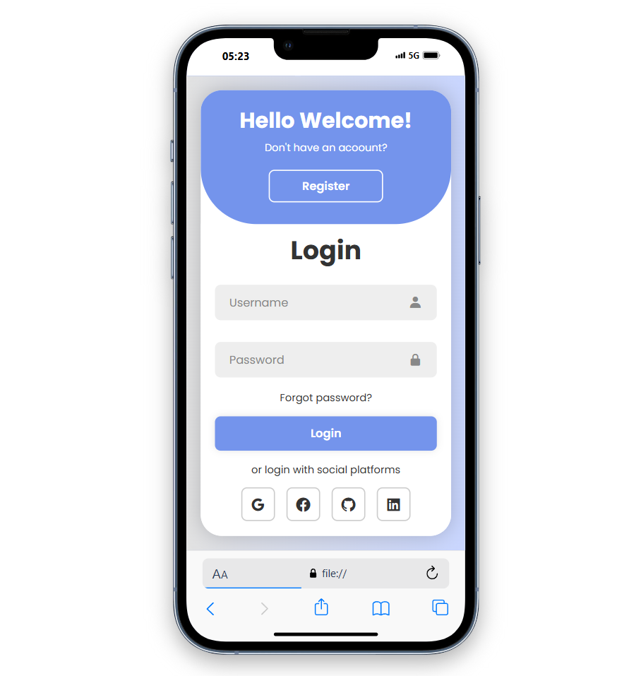
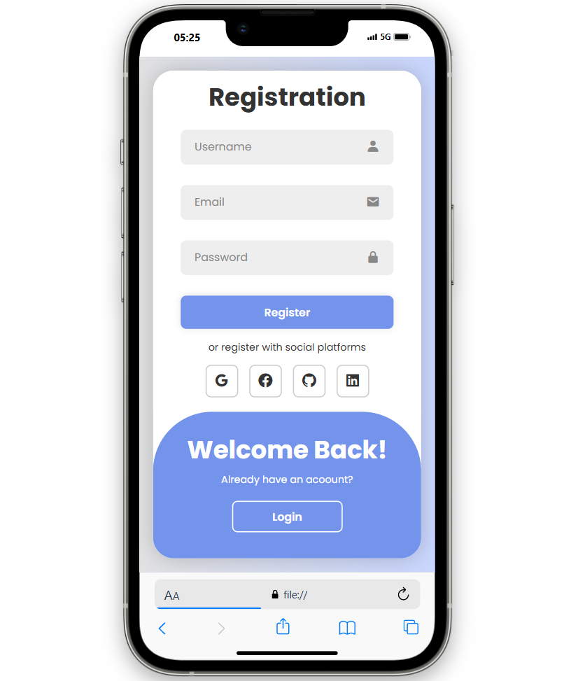
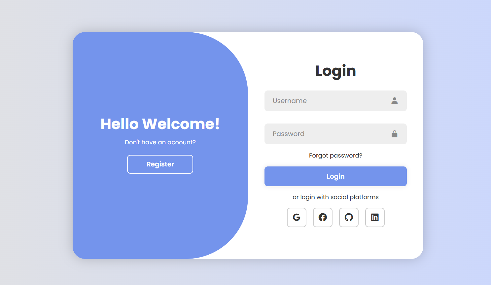
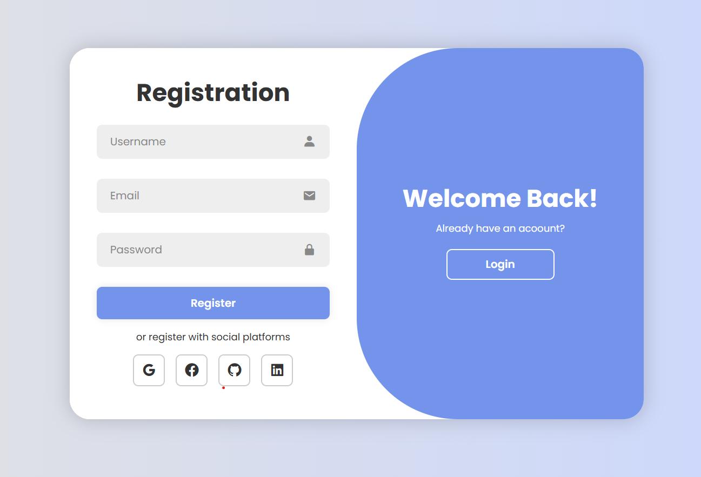

# Login-screen-project

A full responsive login/register screen built with HTML 🌐, CSS🎨, and JavaScript💻.

---

**Features**  💡

* Responsive design for all devices.

* Toggle between Login and Register forms.

* Modern design with animations.

 ---

 **Screenshots** 🌟

           

---

### Installation

1. Clone the repository to your local machine:

   ```bash
   git clone https://github.com/SametBas1/Login-screen.git


 

